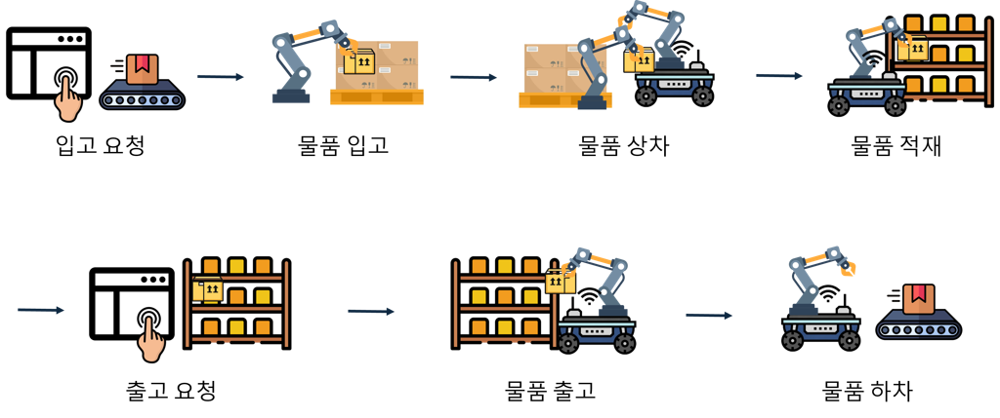
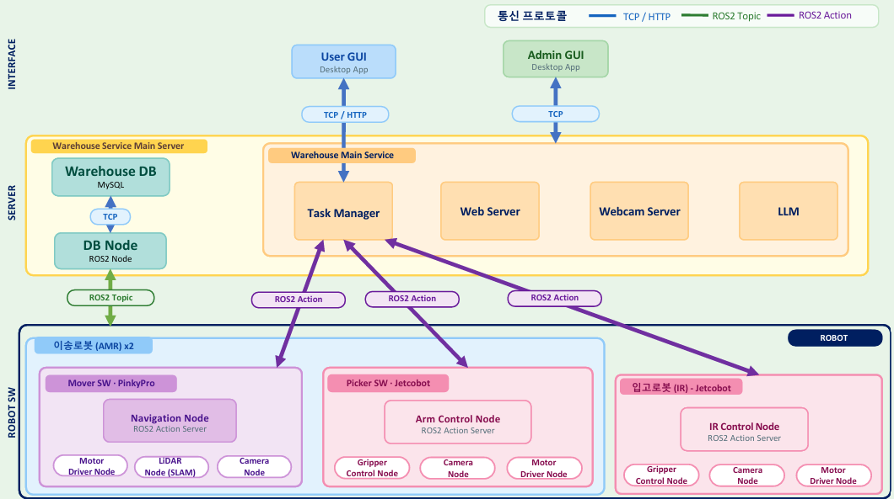
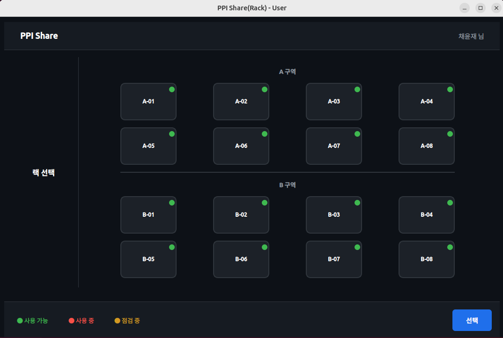
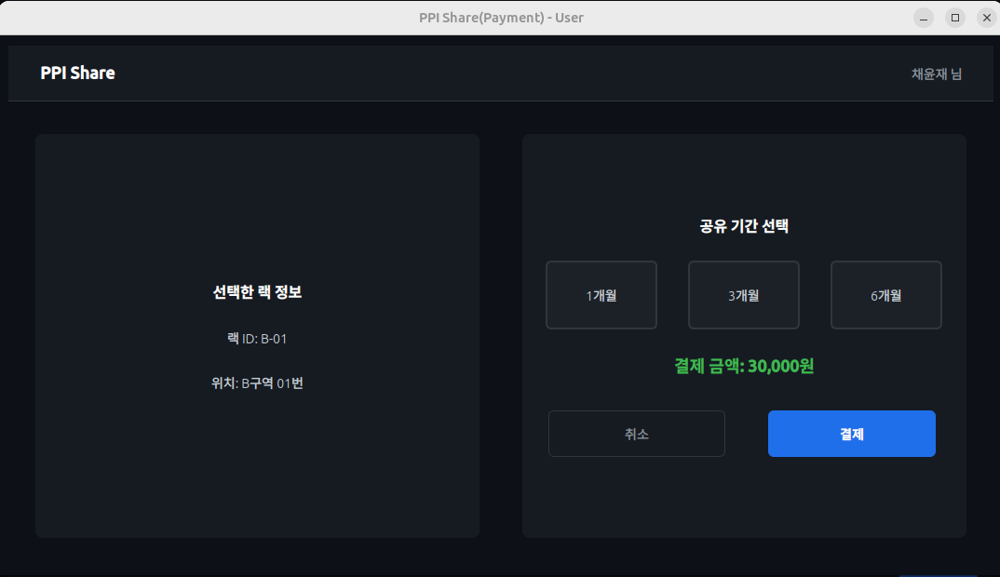
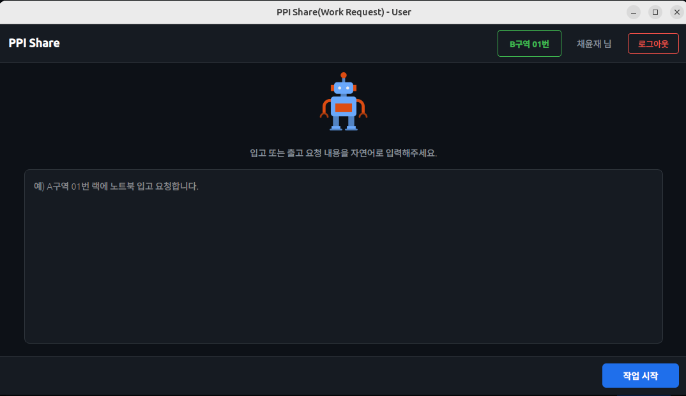
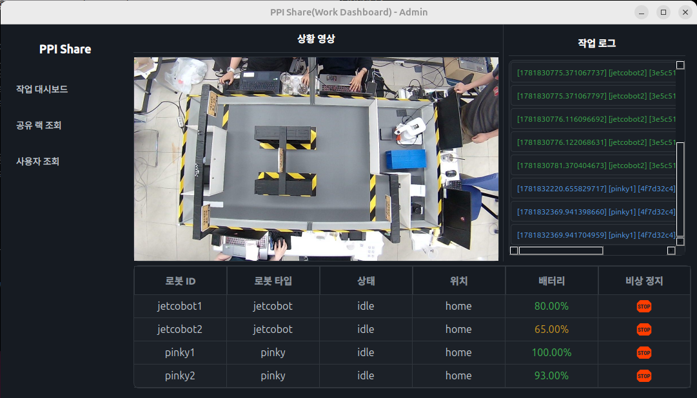
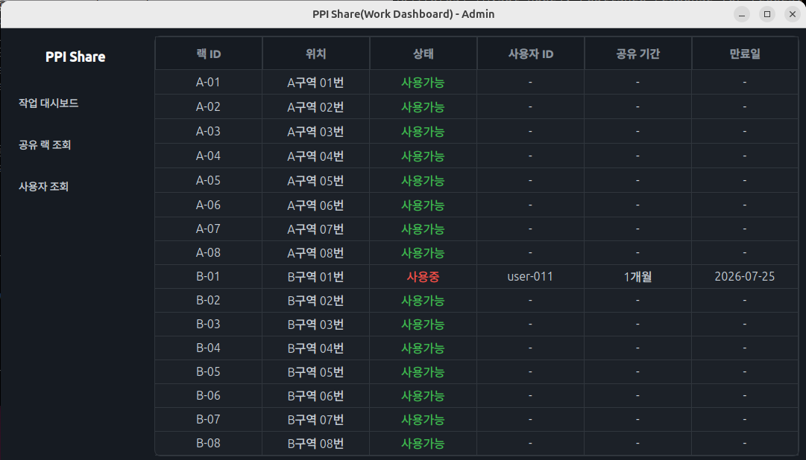
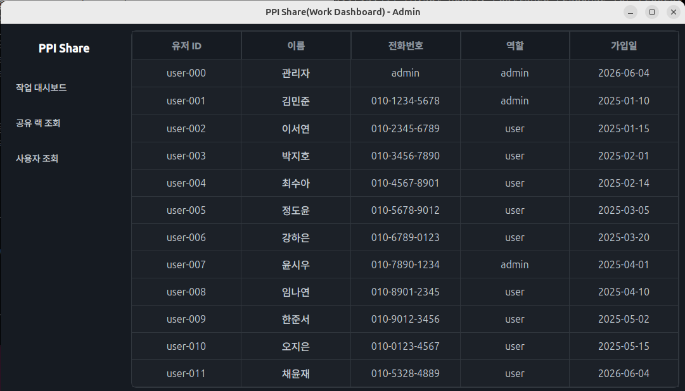

# 🏭 PPI Share - 스마트 공유 창고 시스템

> 자율주행과 로봇팔을 이용한 스마트 소형 공유 창고 시스템

<br>

## 📌 목차

- [프로젝트 개요](#-프로젝트-개요)
- [팀 구성 및 역할](#-팀-구성-및-역할)
- [기술 스택](#-기술-스택)
- [System Scenario](#-system-scenario)
- [System Architecture](#-system-architecture)
- [GUI - 사용자 & 관리자](#-gui---사용자--관리자)
- [각 로봇별 기능](#-각-로봇별-기능)
- [데모 영상](#-데모-영상)
- [레포 구조](#-레포-구조)
- [패키지 소개](#-패키지-소개)
- [사전 패키지 설치](#-사전-패키지-설치)


<br>

## 📖 프로젝트 개요

<!-- 프로젝트 배경, 목적, 주요 기능 등을 작성해주세요 -->

<table>
  <thead>
    <tr>
      <th width="120" style="text-align:center">항목</th>
      <th width=650" style="text-align:center">내용</th>
    </tr>
  </thead>
  <tbody>
    <tr>
      <td align="center">프로젝트명</td>
      <td>스마트 공유 창고 시스템</td>
    </tr>
    <tr>
      <td align="center">개발 기간</td>
      <td>2026.04.22 ~ 2026.06.26</td>
    </tr>
    <tr>
      <td align="center">개발 인원</td>
      <td>6명</td>
    </tr>
    <tr>
      <td align="center">프로젝트 소개</td>
      <td>1인 창업자 증가로 소형 창고 수요가 확대되고 있으나, 기존 개인 스토리지 서비스는 예약·결제 등 소프트웨어 자동화에 머물러 물리적 적재·반출은 여전히 인력에 의존하고 있음<br> 대형 물류 자동화 시스템은 높은 비용으로 소형 환경 도입이 어려워, 저비용 소형 창고 자동화 솔루션의 필요성이 느낌<br> 따라서 자율주행 로봇과 로봇팔을 결합한 소형 공유 창고의 입고·보관·출고를 자동화하는 시스템을 개발하고자 함</td>
    </tr>
  </tbody>
</table>

<br>

## 👥 팀 구성 및 역할

<!-- 팀원 이름, 역할, GitHub 링크 등을 작성해주세요 -->

<table>
  <thead>
    <tr>
      <th width="80" style="text-align:center">이름</th>
      <th width="80" style="text-align:center">역할</th>
      <th width="480" style="text-align:center">작업</th>
      <th width="80" style="text-align:center">GitHub</th>
    </tr>
  </thead>
  <tbody>
    <tr>
      <td align="center">채윤재</td>
      <td align="center">팀장</td>
      <td>프로젝트 설계(UR·SR 등)<br>설계 문서 취합 및 정리<br>사용자 및 관리자 GUI 개발<br>운송 Manipulator 기능 구현(랙 공간 탐색, QR 코드 인식)</td>
      <td align="center"><a href="https://github.com/GroovyCat">@GroovyCat</a></td>
    </tr>
    <tr>
      <td align="center">김성은</td>
      <td align="center">팀원</td>
      <td>작업 내용 나열</td>
      <td align="center"><a href="#">@username</a></td>
    </tr>
    <tr>
      <td align="center">방석진</td>
      <td align="center">팀원</td>
      <td>작업 내용 나열</td>
      <td align="center"><a href="#">@username</a></td>
    </tr>
    <tr>
      <td align="center">서동찬</td>
      <td align="center">팀원</td>
      <td>로봇 자율주행 제어 구현, DB 설계 및 DB 노드 구현, IR센서 라인트레이싱, 초음파센서 주차</td>
      <td align="center"><a href="https://github.com/ddaammss">@ddaammss</a></td>
    </tr>
    <tr>
      <td align="center">이태경</td>
      <td align="center">팀원</td>
      <td>작업 내용 나열</td>
      <td align="center"><a href="#">@username</a></td>
    </tr>
    <tr>
      <td align="center">정창현</td>
      <td align="center">팀원</td>
      <td>작업 내용 나열</td>
      <td align="center"><a href="#">@username</a></td>
    </tr>
  </tbody>
</table>

<br>

## 🛠 기술 스택

| 분류 | 기술 |
|------|------|
| 개발환경 |    |
| 언어 |   |
| UI |  |
| DBMS |  |
| 인식 |  |
| LLM |  
| 자율주행 |   |
| 협업 |      |

<br>

## 🎬 System Scenario

<!-- 시스템 시나리오 다이어그램을 삽입해주세요 -->



<br>

## 🏗 System Architecture

<!-- 시스템 아키텍처 다이어그램을 삽입해주세요 -->



<br>

## 🖥 GUI - 사용자 & 관리자

<!-- GUI 스크린샷을 삽입해주세요 -->

### 사용자 화면

**공유 랙 선택**




**공유 랙 결제**




**입·출고 작업 요청**




### 관리자 화면

**대시보드**




**랙 관리**




**사용자 관리**




<br>

## 🤖 각 로봇별 기능

<!-- 각 로봇의 기능 사진 및 설명을 작성해주세요 -->

### IR (입고 로봇) - JetcoBot

비전 기반 입고(Pick & Place) 매니퓰레이터 모듈. MyCobot280 + Jetson + ROS2 + OpenCV 기반으로, 카메라로 박스를 인식해 정렬 → 픽업 → 적재 슬롯에 내려놓는 과정을 자동화하고, 예외 상황(공잡이, 낙하)을 검출·재시도하며, 적재 순서를 우선순위 큐로 관리한다.

#### 핵심 기능

| 기능 | 설명 |
|---|---|
| 트리거 기반 카메라 활성화 | 입고 명령 전까지 카메라 프레임을 읽지 않고 대기, 트리거 시점에만 캡처 시작 → 유휴 CPU 사용량 절감 |
| 박스 탐지 & 오차 계산 | OpenCV 컨투어 기반 박스 탐지, 카메라 중심 대비 오차(ex, ey) 계산 |
| IBVS 정렬 제어 | 픽셀 오차를 EMA 필터(α=0.6)로 평활화한 뒤 비례 제어로 관절 구동 — 평균 정렬 시간 66s → 11s (**83% 단축**) |
| z거리 추정 & 그리퍼 자동 계산 | 핀홀 카메라 모델 기반(면적 ∝ 1/거리²)으로 거리 추정, 박스 크기별 그리퍼 폭 자동 산출 |
| Pick & Place 예외처리 | 그리퍼 target/actual 값 diff로 공잡이(빈 그립) 판정 → 재시도 / Place 후 카메라 재감지로 낙하 판정 |
| 대기 테이블 우선순위 큐 (Priority Aging) | 슬롯 입고 후 경과 시간에 따라 priority_level 가중치 상승, 핑키(AMR) 도착 시 큐 정렬 후 1개씩 출고 |

---

#### 1. 트리거 기반 카메라 활성화

입고 명령이 들어오기 전까지는 카메라 프레임을 읽지 않고 대기하다가, 트리거가 들어오는 순간에만 캡처를 시작한다. 불필요한 프레임 읽기를 제거해 유휴 상태의 CPU 사용량을 낮췄다.

#### 2. 박스 탐지 & 중앙 정렬

```
카메라 on → 프레임 캡처 → OpenCV 박스 탐지(컨투어/사각형 검출)
   → 박스 발견 → 중앙 정렬 오차 확인(박스 중심 vs 카메라 중심)
        ├─ 오차 범위 밖 → 계속 탐지
        └─ 오차 범위 내(중앙 정렬 완료) → Pick
```

- 녹색 컨투어: 박스 감지 / 십자선: 카메라 중심 / 붉은 점: 박스 중심선
- `ex`, `ey` 값이 0에 가까울수록 중앙 정렬 완료 상태
- EMA 필터 기반으로 정렬 과정을 부드럽게 처리 (smooth + EMA + stable counter)

#### 3. IBVS 기반 오차 보정 & 로봇 제어

픽셀 오차를 EMA로 평활화한 뒤 비례 제어로 관절을 움직이는 폐루프 제어.

- EMA 필터 노이즈 억제 계수: **α = 0.6**
- 단계별 개선 결과(평균 정렬 소요 시간): **66s → 11s (83% 단축)**

#### 4. z거리 추정 & 그리퍼 자동 계산

핀홀 카메라 모델 기반 — 박스가 카메라에 가까울수록 픽셀 면적이 커지는 관계(면적 ∝ 1/거리²)를 이용해 z거리를 추정하고, 박스 크기에 따라 그리퍼 폭을 자동 계산한다. 박스 크기별 추정 결과를 비교·검증했다.

#### 5. Pick & Place 예외처리

**Pick 실패 (공잡이) 검출 및 재시도**

그리퍼가 닫혔지만 박스를 놓친 "공잡이" 상태를 target/actual 그리퍼값의 diff로 판정한다.

```
INFO 그리퍼 감지: target=13 actual=14 diff=1
→ 공잡이 판정 (diff < 5)
WARN 박스를 잡지 못했습니다 (시도 1/3)
```

공잡이 발생 시 그리퍼를 열고 홈 위치로 복귀한 뒤 재시도한다.

**Place 후 카메라 재감지 (낙하 감지)**

박스를 슬롯에 내려놓은 뒤 카메라로 해당 위치를 재촬영해 윤곽(bounding box)과 중심 좌표를 검출, 정상 적재 여부를 확인한다.

```
INFO 낙하 감지: 슬롯 0 감지 자세로 이동 (J1=118.78°)
large w=173px  ex=+133  ey=+39
INFO 슬롯 0 박스 확인 [OK] → on_box_placed()
```

#### 6. 대기 테이블 우선순위 큐 (Priority Aging)

슬롯에 입고된 후 경과 시간에 따라 `priority_level`을 올리고, 핑키(AMR) 도착 시점에 우선순위 큐를 정렬해 1개씩 출고한다.

**실제 동작 검증 — 동일 로직(`_start_loading()`)의 분기 처리**

| 케이스 | 조건 | 결과 |
|---|---|---|
| CASE 1 · PRIORITY | 슬롯 3개 모두 채워진 상태에서 박스 3개 대기 | aging으로 priority_level이 가장 높아진 박스를 그리퍼가 직접 선택해 픽업 — `[Priority] 슬롯1(P2) 슬롯2(P5) 슬롯3(P1) → pick 슬롯2 (priority 최댓값)` |
| CASE 2 · FIFO | 박스 2개의 priority_level이 동점 | 입고 명령이 들어오면 먼저 적재된(도착순이 빠른) 박스를 우선 처리 — `[Tie] 슬롯1(P3, 도착 1번) 슬롯2(P3, 도착 2번) → 동점 → 도착순(FIFO) → pick 슬롯1` |

### AMR Manipulator(이송로봇 로봇팔) - JetcoBot

카메라 기반 비전 인식 모듈. MyCobot280 + Raspberry Pi + ROS2 + OpenCV 기반으로, 박스 위치 검출 → 랙 빈 공간 탐지 → QR 코드 인식의 3단계 파이프라인을 통해 출고 대상 박스를 자동으로 식별하고 적재 위치를 판단한다.

#### 핵심 기능

| 기능 | 설명 |
|---|---|
| 박스 위치 검출 (2단계) | HSV 흰색 마스킹으로 박스 존재 1차 판별 후, 컨투어 조건 필터링으로 정밀 검출 — cx, cy 중심 좌표 반환 |
| 랙 빈 공간 탐지 (2단계) | GaussianBlur + adaptiveThreshold로 이진화 후 좌/우 비율 계산 — threshold 7% 기준으로 빈 공간 판정 |
| QR 코드 인식 (2단계) | GRAY 변환 + 감마 보정 + adaptiveThreshold 전처리 후 pyzbar 디코딩 — box_id, position, distance_cm 반환 |

---

#### 1. 박스 위치 검출

2단계 필터 구조로 박스를 검출한다. 1단계(빠른 필터)에서 박스 유무를 빠르게 판별하고, 통과 시 2단계(정밀 필터)에서 정확한 위치를 확정한다.

**1단계 — 흰색 영역 판별 (빠른 필터)**

```
카메라 프레임 (640×480)
  → ROI 추출 (400×400 크롭)
  → GaussianBlur(21,21) + HSV 변환
  → cv2.inRange() 흰색 마스킹
  → MORPH 연산 (노이즈 제거)
  → white_area > 5,000 px ? → YES: 2단계 진행 / NO: 박스 없음
```

**2단계 — 사각형 형태 판별 (정밀 필터)**

1단계 통과 프레임에서 `cv2.findContours()`로 외곽 윤곽선을 추출하고, 아래 4가지 조건을 모두 통과한 윤곽선의 cx, cy를 반환한다.

| 조건 | 기준 | 설명 |
|---|---|---|
| 조건 1 | area ≥ 500 px² | 너무 작은 윤곽선 제거 |
| 조건 2 | 4 ≤ approxPolyDP ≤ 8 | 사각형에 가까운 다각형만 통과 |
| 조건 3 | 모든 변의 길이 > 30 px | 너무 얇거나 짧은 형태 제거 |
| 조건 4 | 0.5 ≤ min변/max변 ≤ 1.0 | 극단적으로 찌그러진 형태 제거 |


---

#### 2. 랙 빈 공간 탐지

카메라 입력을 mid_x 기준으로 좌/우로 분할해 각각 독립적으로 빈 공간을 판별한다. 절대 밝기가 아닌 주변 대비 상대적 밝기를 기준으로 판단해 낮/밤 조명 변화에 강하다.

**전처리 파이프라인**

```
카메라 입력 → ROI 추출 → 좌/우 분할 (mid_x 기준)
  → GaussianBlur(7,7) + GRAY 변환
  → adaptiveThreshold (block_size=51, C=-10)
  → MORPH_OPEN + MORPH_CLOSE (kernel=3,3)
  → 흰색 비율 계산 → threshold 7% 기준 판정
```


**판정 로직**

| 조건 | 결과 |
|---|---|
| left_ratio < 7% | left_empty = True (빈 공간) |
| left_ratio ≥ 7% | left_empty = False (박스 있음) |
| right_ratio < 7% | right_empty = True (빈 공간) |
| right_ratio ≥ 7% | right_empty = False (박스 있음) |

반환값: `left_empty`, `right_empty`, `left_ratio`, `right_ratio`, `debug_frame`


---

#### 3. QR 코드 인식

**1단계 — 전처리 (인식률 향상)**

```
GRAY 변환 (cv2.cvtColor BGR2GRAY)
  → 감마 보정 reduce_glare() (γ=1.8, 빛 번짐 완화)
  → adaptiveThreshold 이진화 (block_size=15, C=5)
  → candidates = [원본 frame, adaptive 이진화]
```

**2~3단계 — 디코딩 + 조건 검사 → 최종 결과**

candidates를 순회하며 `pyzbar.decode()`로 디코딩하고, 검출된 QR마다 아래 조건을 검사한다.

```
JSON 파싱 + box_id / item 존재 확인
  → 조건 1: tilt_angle ≤ 45° (estimate_tilt_angle())
  → 부가 정보 계산: cx, cy, distance_cm, in_range, qr_pixel_size, in_angle
  → 조건 2: target_item 과 일치 여부 확인
  → 매칭 성공 → parsed 반환
```

반환값: `box_id`, `item`, `position`, `cx`, `cy`, `distance_cm`, `tilt_angle`, `in_range`, `in_angle`, `qr_pixel_size`

### AMR (이송 로봇) - PinkyPro

| 기능 | 설명 |
|------|------|
| 로봇 자율주행 제어 | SLAM 기반 맵 생성 및 Nav2를 활용한 구역 간 자율주행 |
| ArUco 마커 정밀 도킹 | 카메라로 ArUco 마커를 인식해 cm 단위 정밀 도킹 구현 |
| IR센서 라인트레이싱 | IR센서를 활용한 라인 추종 주행 |
| 초음파센서 주차 | 초음파센서 기반 정밀 주차 제어 |
<!-- | DB 설계 및 DB 노드 구현 | MySQL 기반 작업 상태·이력 관리, ROS2 DB 노드 통신 | -->

#### 1. 로봇 자율주행 제어

SLAM으로 생성한 맵 위에서 Nav2를 이용해 목표 구역까지 경로를 계획하고 자율주행한다. ArUco 마커를 통해 위치를 보정하며, 장애물 회피와 경로 재계획을 실시간으로 처리한다.

Nav2 Costmap 파라미터 중 `inflation_radius`와 `cost_scaling_factor` 튜닝이 자율주행 성능에 가장 직접적인 영향을 미친다.

| 구분 | Global Costmap | Local Costmap |
|------|---------------|--------------|
| 실행 시점 | navigate_to_pose 경로 계획 | 주행 중 실시간 반복 |
| 장애물 기준 | 저장된 정적 맵 | 라이다 센서 실시간 감지 |
| inflation_radius | 2.0 m | 0.15 m |
| cost_scaling_factor | 0.1 | 0.05 |

#### 2. ArUco 마커 정밀 도킹

Nav2만으로는 수 cm 단위 정밀 정차가 불가능하여, 카메라로 ArUco 마커를 인식해 자동 정밀 도킹을 구현했다. Nav2로 목표 지점에 도착한 뒤 마커를 감지하면 좌우로 정렬하며 전진한다. 마커의 좌우 높이 차이로 비스듬한 접근을 감지하고, 전진하면서 각도를 동시에 미세 보정해 정면 정차를 보장한다.

```
Nav2 도착 → 마커 감지 → 좌우 정렬 → 전진 → 자세 정렬 → 도킹 완료
```

#### 3. IR센서 라인트레이싱

TCRT5000 적외선 반사 센서 3개(좌/중앙/우)를 로봇 하단 전면에 가로로 배치하여 라인 위치를 판단한다. 좌/우 센서가 라인을 벗어나면 비대칭을 error로 환산해 보정하고, 중앙 센서가 흰선을 감지하면 정지 신호로 처리한다. On/Off 제어 대신 P 제어를 적용해 오차에 비례한 각속도로 부드럽게 라인을 추종한다.

```
IR 감지 → error 계산 → 각속도 보정 → 중앙 흰선 → 정지
```

#### 4. 초음파센서 주차

IR 라인트레이싱 완료 후 초음파센서로 정밀 거리 제어를 담당한다. US-016 초음파 거리 센서로 전방 거리를 지속 측정하며 직진하고, 정지 거리(0.065m) 이하로 줄어지면 직진을 멈추고 180도 회전해 적재 자세로 전환한다.

```
초음파 감지 → 거리 측정 → 직진 → 0.065m 이하 정지 → 180도 회전
```


<br>

## 🎥 데모 영상

<!-- 데모 영상 링크 또는 GIF를 삽입해주세요 -->

[](https://youtu.be/oy5oopDwQ6k)

<br>

## 📁 레포 구조

```
roscamp-repo-2/
└── src/
    ├── jetcobot1/            # 입고 매니퓰레이터 (MyCobot280) 제어 패키지
    ├── jetcobot2/            # 운송 매니퓰레이터 (MyCobot280) 제어 패키지
    ├── pinky1/               # AMR 1호 (자율주행 이송 로봇) 제어 패키지
    ├── pinky2/               # AMR 2호 (자율주행 이송 로봇) 제어 패키지
    ├── ppi_gui/              # 사용자 및 관리자 GUI (PyQt5)
    ├── db/                   # MySQL DB 연결 및 쿼리 처리 패키지
    ├── ppibigi_interfaces/   # 커스텀 메시지/서비스 인터페이스 정의
    └── server/               # 서버 모듈
        ├── camera/           # 카메라 스트리밍 서버
        ├── llm/              # LLM (Qwen) 웹 서버 및 파인튜닝
        └── task_manager/     # 태스크 매니저 (FastAPI)
```

`src/` 폴더 안에 각 로봇 제어, GUI, DB, 서버 등의 ROS2 패키지가 들어있습니다.

<br>

## 📦 패키지 소개

각 패키지는 Python(`ament_python`) 기반의 ROS2 패키지입니다.

| 패키지 이름 | 대상 | 설명 |
|------------|------|------|
| jetcobot1 | 입고 매니퓰레이터 | 박스 인식, Pick & Place, 우선순위 큐, 음성 제어 |
| jetcobot2 | 운송 매니퓰레이터 | 랙 공간 탐색, QR 코드 인식, 적재/반출 |
| pinky1 | AMR 1호 | 자율주행 (SLAM & Nav2), ArUco 인식, 센서 관리 |
| pinky2 | AMR 2호 | 자율주행 (SLAM & Nav2), 구역 간 이송 |
| ppi_gui | GUI | 사용자/관리자 화면 (PyQt5), 카메라 스트리밍 뷰 |
| db | 공통 | MySQL DB 연결 및 쿼리 실행 노드, DB 클라이언트 라이브러리 |
| ppibigi_interfaces | 공통 | 커스텀 메시지/서비스 인터페이스 정의 |
| server | 서버 | 카메라 서버, LLM 웹 서버 (Qwen), 태스크 매니저 (FastAPI) |

### 공통 의존성

| 패키지 | 용도 |
|--------|------|
| rclpy | ROS2 Python 클라이언트 라이브러리 (노드 생성, 토픽/서비스 통신 등) |
| std_msgs | 기본 메시지 타입 (String, Int32, Bool 등) |
| geometry_msgs | 위치/속도 관련 메시지 (Twist, Pose 등) |
| nav_msgs | 내비게이션 관련 메시지 (Odometry, Path 등) |
| sensor_msgs | 센서 데이터 메시지 (LaserScan, Image, Imu 등) |

<br>

## 📥 사전 패키지 설치

ROS2 패키지 외에 아래 Python 라이브러리를 별도로 설치해야 합니다.

### 일괄 설치

```bash
pip3 install pymysql opencv-python numpy PyQt5 pymycobot flask pyzbar sounddevice openai-whisper fastapi uvicorn pydantic requests python-dateutil
```

### 시스템 패키지

```bash
sudo apt install libzbar0 ros-${ROS_DISTRO}-cv-bridge
```

### 패키지별 용도

| 패키지 | 용도 | 사용 패키지 |
|--------|------|-------------|
| pymysql | MySQL DB 연결 | db |
| opencv-python | 영상 처리 및 박스/ArUco 인식 | jetcobot1, jetcobot2, pinky1, ppi_gui |
| numpy | 수치 연산 | jetcobot1, jetcobot2, pinky1, ppi_gui |
| PyQt5 | 사용자/관리자 GUI | ppi_gui |
| pymycobot | MyCobot280 로봇팔 제어 | jetcobot1, jetcobot2 |
| flask | 카메라 웹 스트리밍 | jetcobot1, jetcobot2 |
| pyzbar | QR 코드 인식 | jetcobot2 |
| sounddevice | 음성 입력 (마이크) | jetcobot1 |
| openai-whisper | 음성 인식 (STT) | jetcobot1 |
| fastapi | 태스크 매니저 / LLM 웹 API 서버 | server, jetcobot1 |
| uvicorn | FastAPI ASGI 서버 실행 | server, jetcobot1 |
| pydantic | API 데이터 모델 검증 | server, jetcobot1 |
| requests | HTTP 요청 (LLM 서버 호출 등) | jetcobot1, jetcobot2, ppi_gui, server |
| python-dateutil | 날짜 계산 | ppi_gui |
| cv_bridge | ROS2 이미지 ↔ OpenCV 변환 | jetcobot2, pinky1 |

